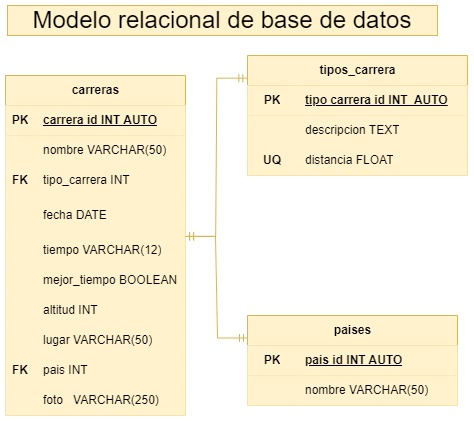

# Carreras clasificado de entidades

## Listado de entidades

### carreras **(ED)**

- carrera_id **(PK)**
- nombre
- tipo_carrera **(FK)**
- fecha
- tiempo
- altitud
- mejor_tiempo
- lugar
- pais **(FK)**
- foto

### tipos_carreras **(EC)**

- tipo_carrera_id **(PK)**
- Nombre
- Distancia **(UQ)**

### paises **(EC)**

- pais_id **(PK)**
- nombre

## Relaciones

1. Una **carrera** _pertenece_ a un **tipo de carrera**. (_1 a 1_)
1. Una **carrera**  se _corre_ en un **pais**. (_1 a 1_)

## Diagramas

### Modelo entidad - relación

### Modelo relacional de la BD

## Reglas de negocio

### Carreras

1. Crear nueva carrera.
1. Actualizar datos de carrera.
1. Leer carrera particular registrada.
1. Leer todas las carreras registradas.
1. Borrar carrera particular registrada.

### Tipos de carreras

1. Crear nuevo tipo de carrera.
1. Actualizar datos de tipo carrera.
1. Leer tipo de carrera particular registrada.
1. Leer todas los tipos de carreras registradas.
1. Borrar tipo de carrera particular registrada.

### Paises

1. Crear nuevo pais.
1. Actualizar datos de pais.
1. Leer pais particular registrado.
1. Leer todos los paises registrados.
1. Borrar pais particular registrado.