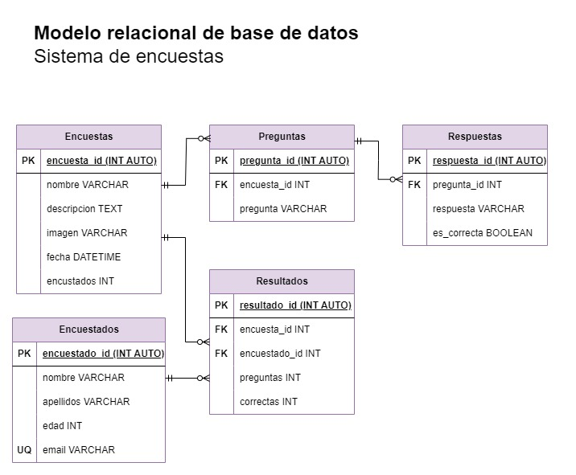

# Encuestas

## Listado de entidades

### encuestas **(ED)**

- encuesta_id **(PK)**
- nombre
- descripcion
- imagen 
- fecha
- encuestado

### preguntas **(ED)**

- pregunta_id **(PK)**
- encuesta_id **(FK)**
- pregunta

### respuesta **(ED)**

- respuesta_id **(PK)**
- pregunta_id **(FK)**
- respuesta
- es_correcta

### encuestados **(ED)**

- encuestado_id **(PK)**
- nombre
- apellidos
- edad
- email **(UQ)**

### resultados **(ED|EP)**

- resultado_id **(PK)**
- encuesta_id **(FK)**
- encuestado_id **(FK)**
- preguntas
- correctas

## Relaciones

1. Una **encuesta** _tiene_ muchas **preguntas**. (_1 a M_)
1. Una **pregunta**  _tiene_ muchas **respuestas**. (_1 a M_)  
1. Una **encuesta**  _tiene_ muchos **resultados**. (_1 a M_) 
1. Un **encuestado**  _tiene_ muchos **resultados**. (_1 a M_) 

## Diagramas

### Modelo relacional de la BD

## Reglas de negocio

### Encuestas

1. Crear nueva encuesta.
1. Actualizar datos de encuesta.
1. Leer encuesta particular registrada.
1. Leer todas las encuestas registradas.
1. Borrar encuesta particular registrada.
1. Incrementar en 1 el valor del atributo encuestados cada que un encuestado complete la encuesta.

### Preguntas

1. Crear nueva pregunta.
1. Actualizar pregunta.
1. Leer pregunta particular registrada.
1. Leer todas las preguntas registradas.
1. Borrar pregunta particular registrada.

### Respuestas

1. Crear nueva respuesta.
1. Actualizar respuesta.
1. Leer respuesta registrada.
1. Leer todas las respuestas registradas.
1. Borrar respuesta particular registrada.

### Encuestados

1. Crear nuevo encuestado.
1. Actualizar encuestado.
1. Leer encuestado registrada.
1. Leer todos los encuestados registrados.
1. Borrar encuestado particular registrado.
1. Antes de crear un nuevo encuestado en la entidad, verificar mediante su email que no exista.

### Resultados

1. Crear nuevo resultado.
1. Actualizar resultado.
1. Leer resultado registrado.
1. Leer todos los resultados registrados.
1. Borrar resultado particular registrado.